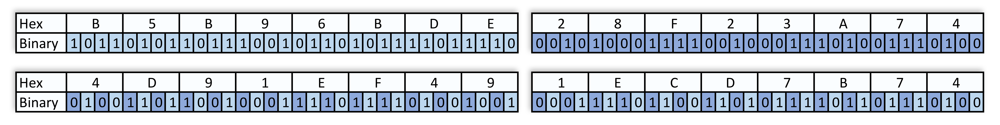

# Geohash.NET

Geohash.NET is a lightweight, high-performance C# library for encoding and decoding string and integer [geohashes](https://en.wikipedia.org/wiki/Geohash).

## Installation

TODO

## Usage

Here's a quick example of how to use the Geohash.NET library:

```c#
using NetGeohash;

// Encode latitude and longitude coordinates into a geohash string
string geohash = Geohash.Encode(37.421999, -122.084057, 9);

// Decode the geohash string into latitude and longitude coordinates
(double latitude, double longitude) = Geohash.Decode(geohash);

// Encode the geohash string into an integer format
ulong geohashInt = Geohash.EncodeToInt64(37.421999, -122.084057, 9);

// Decode the integer geohash into latitude and longitude coordinates
(latitude, longitude) = Geohash.DecodeFromInt64(geohashInt);
```

## Overview

Geohash is a geocoding system that allows you to represent a geographic location using a short, alphanumeric string or integer. It was developed by [Gustavo Niemeyer](https://web.archive.org/web/20080305223755/http://blog.labix.org/#post-85) in 2008 and has since become a popular method for encoding and indexing spatial data.

The concept behind geohashing is to take latitude and longitude coordinates and convert them into a more compact form. This is achieved by recursively subdividing the Earth's surface into rectangular cells, which are then assigned a unique identifier. The length of the geohash determines the level of precision, with longer geohashes representing smaller areas.

Geohash cells have a few notable properties:

- Neighboring cells have similar geohash prefixes, making it possible to quickly identify nearby locations by comparing their geohashes.
- Geohashes can be easily truncated to lower their precision, allowing for flexible trade-offs between spatial resolution and computational efficiency.
- The rectangular cells can be represented using different formats, such as base-32 strings or 64-bit integers, depending on the desired balance between human-readability and storage efficiency.

## How it works

For example, to generate a geohash string for the location with latitude 37.7749 and longitude -122.4194 at a precision level of 12, we can follow these three stages:

### 1. Quantization

[Quantize](https://en.wikipedia.org/wiki/Quantization) latitude and longitude to 32-bit integers by mapping to the unit interval [0, 1] and multiplying by 2^32 (`exp2(32)`):

Latitude takes the range [-90, 90], therefore the 32-bit integer representation of latitude is

```csharp
lat32 = floor(exp2(32) * (latitude + 90) / 180)
```

Which in our case equals to 3048827870 (`0b10110101101110010110101111011110`)

Likewise for longitude [-180, 180]:

```csharp
lng32 = floor(exp2(32) * (longitude + 180) / 360)
```

Which in our case equals to 686963316 (`0b101000111100100011101001110100`)

### 2. Bit Interleaving

The 32-bit quantized latitude and longitude are **bit-interleaved** to produce a 64-bit value (the **integer geohash**).

The diagram below illustrates the operation.



> Note: *latitude and longitude occupy even and odd bits respectively*.

In our running example the integer geohash is: 5589511709871930228 (`0b0100110110010001111011110100100100011110110011010111101101110100`)

This number should be taken at lower precision. The precision of integer geohash consists of the N **high** bits, so we need to truncate excess bits. We can do so by bits shift operation:

```csharp
hash = interleaved >> (sizeof(ulong) * BITS_PER_BYTE - log2(32) * precision) // 64 - 5 * precision
```

Which is 349344481866995639 (`0b010011011001000111101111010010010001111011001101011110110111`) for our example.

> Note: this step ultimately provides geohash’s critical **prefix property**: the geohash of a point at a lower precision is a prefix of the geohash at a higher precision. Therefore proximity searches can be reduced to matching geohash prefixes (as a first pass).

### 3. Base32 Encoding

The string geohash is obtained from the integer geohash by [base32 encoding](https://en.wikipedia.org/wiki/Base32). This is standard except for the choice of alphabet. Each geohash character represents a 5-bit (`log2(32)`) binary value, and the entire geohash string is made up of multiple concatenated 5-bit values.

```text
0123456789bcdefghjkmnpqrstuvwxyz
```

Encoding starts at the high bits, consuming 5 bits of the integer geohash for each character of precision. **As a result the maximum precision is 12 characters or 60 bits**.

Divide the binary value into groups of 5 bits and convert each group to its corresponding base-32 character:

```text
01001 ( 9) - 9
10110 (22) - q
01000 ( 8) - 8
11110 (30) - y
11110 (30) - y
10010 (18) - k
01000 ( 8) - 8
11110 (30) - y
11001 (25) - t
10101 (21) - p
11101 (29) - x
10111 (23) - r
```

Concatenate all of the base-32 characters together to form the final geohash string: `9q8yyk8ytpxr`

For internal use cases integer geohash is usually ***sufficient***. The base32 step was included here for completeness.

## Benchmarks

### Setup

``` ini

BenchmarkDotNet=v0.13.5, OS=Windows 11 (10.0.22000.1696/21H2/SunValley)
AMD Ryzen 9 3900X, 1 CPU, 24 logical and 12 physical cores
.NET SDK=8.0.100-preview.1.23115.2
  [Host]     : .NET 8.0.0 (8.0.23.11008), X64 RyuJIT AVX2
  Job-KKMPKU : .NET 8.0.0 (8.0.23.11008), X64 RyuJIT AVX2

Jit=RyuJit  Platform=X64  Runtime=.NET 8.0  

```

### Decode

|         Method |        Input |       Mean |     Error |    StdDev | Code Size |   Gen0 | Allocated |
|--------------- |------------- |-----------:|----------:|----------:|----------:|-------:|----------:|
|     **NetGeohash** |            **k** |   **8.112 ns** | **0.1881 ns** | **0.2090 ns** |   **1,717 B** |      **-** |         **-** |
| NetCoreGeohash |            k | 145.271 ns | 0.8736 ns | 0.7295 ns |      18 B | 0.0038 |      32 B |
|    NGeoHashLib |            k | 143.414 ns | 0.8529 ns | 0.7561 ns |       9 B | 0.0229 |     192 B |
|     **NetGeohash** |           **yd** |   **8.442 ns** | **0.1032 ns** | **0.0965 ns** |   **1,717 B** |      **-** |         **-** |
| NetCoreGeohash |           yd | 166.305 ns | 0.8682 ns | 0.8121 ns |      18 B | 0.0038 |      32 B |
|    NGeoHashLib |           yd | 169.663 ns | 1.0957 ns | 1.0249 ns |       9 B | 0.0229 |     192 B |
|     **NetGeohash** |          **6n3** |   **9.442 ns** | **0.1746 ns** | **0.1633 ns** |   **1,717 B** |      **-** |         **-** |
| NetCoreGeohash |          6n3 | 192.502 ns | 2.0566 ns | 1.9238 ns |      18 B | 0.0038 |      32 B |
|    NGeoHashLib |          6n3 | 202.150 ns | 1.9676 ns | 1.8405 ns |       9 B | 0.0229 |     192 B |
|     **NetGeohash** |         **zvgk** |  **10.183 ns** | **0.1023 ns** | **0.0907 ns** |   **1,717 B** |      **-** |         **-** |
| NetCoreGeohash |         zvgk | 218.244 ns | 1.4455 ns | 1.3521 ns |      18 B | 0.0038 |      32 B |
|    NGeoHashLib |         zvgk | 223.580 ns | 0.7643 ns | 0.6776 ns |       9 B | 0.0229 |     192 B |
|     **NetGeohash** |        **t05kh** |  **10.726 ns** | **0.2016 ns** | **0.1886 ns** |   **1,717 B** |      **-** |         **-** |
| NetCoreGeohash |        t05kh | 310.208 ns | 0.9773 ns | 0.8663 ns |      18 B | 0.0038 |      32 B |
|    NGeoHashLib |        t05kh | 263.364 ns | 2.2418 ns | 2.0970 ns |       9 B | 0.0229 |     192 B |
|     **NetGeohash** |       **b5cv2h** |  **11.413 ns** | **0.0796 ns** | **0.0706 ns** |   **1,717 B** |      **-** |         **-** |
| NetCoreGeohash |       b5cv2h | 328.490 ns | 2.4518 ns | 2.1735 ns |      18 B | 0.0038 |      32 B |
|    NGeoHashLib |       b5cv2h | 283.862 ns | 2.9657 ns | 2.7741 ns |       9 B | 0.0229 |     192 B |
|     **NetGeohash** |      **vveyj80** |  **12.114 ns** | **0.1749 ns** | **0.1636 ns** |   **1,717 B** |      **-** |         **-** |
| NetCoreGeohash |      vveyj80 | 358.143 ns | 0.9470 ns | 0.7908 ns |      18 B | 0.0038 |      32 B |
|    NGeoHashLib |      vveyj80 | 318.725 ns | 1.7533 ns | 1.6400 ns |       9 B | 0.0229 |     192 B |
|     **NetGeohash** |     **f7y53xjt** |  **12.676 ns** | **0.2287 ns** | **0.2140 ns** |   **1,717 B** |      **-** |         **-** |
| NetCoreGeohash |     f7y53xjt | 380.157 ns | 2.2520 ns | 2.1065 ns |      18 B | 0.0038 |      32 B |
|    NGeoHashLib |     f7y53xjt | 334.277 ns | 1.0733 ns | 1.0039 ns |       9 B | 0.0229 |     192 B |
|     **NetGeohash** |    **trm92jkbv** |  **12.990 ns** | **0.1217 ns** | **0.1139 ns** |   **1,717 B** |      **-** |         **-** |
| NetCoreGeohash |    trm92jkbv | 404.136 ns | 1.9322 ns | 1.7128 ns |      18 B | 0.0038 |      32 B |
|    NGeoHashLib |    trm92jkbv | 374.209 ns | 1.0807 ns | 1.0109 ns |       9 B | 0.0229 |     192 B |
|     **NetGeohash** |   **drmq3gx6zt** |  **13.861 ns** | **0.1824 ns** | **0.1706 ns** |   **1,717 B** |      **-** |         **-** |
| NetCoreGeohash |   drmq3gx6zt | 429.735 ns | 1.6946 ns | 1.4151 ns |      18 B | 0.0038 |      32 B |
|    NGeoHashLib |   drmq3gx6zt | 400.585 ns | 1.9080 ns | 1.7847 ns |       9 B | 0.0229 |     192 B |
|     **NetGeohash** |  **9zefgnuj7dw** |  **14.265 ns** | **0.2997 ns** | **0.2803 ns** |   **1,717 B** |      **-** |         **-** |
| NetCoreGeohash |  9zefgnuj7dw | 455.781 ns | 3.3098 ns | 2.9341 ns |      18 B | 0.0038 |      32 B |
|    NGeoHashLib |  9zefgnuj7dw | 416.747 ns | 2.7821 ns | 2.6023 ns |       9 B | 0.0229 |     192 B |
|     **NetGeohash** | **k9m2h7t1n0c2** |  **14.864 ns** | **0.3210 ns** | **0.3153 ns** |   **1,717 B** |      **-** |         **-** |
| NetCoreGeohash | k9m2h7t1n0c2 | 479.624 ns | 1.5628 ns | 1.3854 ns |      18 B | 0.0038 |      32 B |
|    NGeoHashLib | k9m2h7t1n0c2 | 467.252 ns | 1.3795 ns | 1.2904 ns |       9 B | 0.0229 |     192 B |

![Decode-barplot][decode-barplot-image]

### Encode

|         Method |   latitude |   longitude | precision |      Mean |    Error |   StdDev | Code Size |   Gen0 | Allocated |
|--------------- |----------- |------------ |---------- |----------:|---------:|---------:|----------:|-------:|----------:|
|     **NetGeohash** | **-89.127865** | **-179.438962** |         **7** |  **20.69 ns** | **0.146 ns** | **0.129 ns** |     **906 B** | **0.0048** |      **40 B** |
| NetCoreGeohash | -89.127865 | -179.438962 |         7 | 195.04 ns | 0.632 ns | 0.528 ns |      14 B | 0.0172 |     144 B |
|    NGeoHashLib | -89.127865 | -179.438962 |         7 | 324.45 ns | 3.044 ns | 2.848 ns |      19 B | 0.0458 |     384 B |
|     **NetGeohash** |   **-41.2858** |    **174.7868** |        **12** |  **24.77 ns** | **0.352 ns** | **0.329 ns** |     **906 B** | **0.0057** |      **48 B** |
| NetCoreGeohash |   -41.2858 |    174.7868 |        12 | 318.08 ns | 2.079 ns | 1.944 ns |      14 B | 0.0181 |     152 B |
|    NGeoHashLib |   -41.2858 |    174.7868 |        12 | 493.78 ns | 2.879 ns | 2.552 ns |      19 B | 0.0687 |     576 B |
|     **NetGeohash** | **-12.347856** |   **34.890273** |         **3** |  **17.95 ns** | **0.215 ns** | **0.201 ns** |     **906 B** | **0.0038** |      **32 B** |
| NetCoreGeohash | -12.347856 |   34.890273 |         3 | 104.91 ns | 0.616 ns | 0.546 ns |      14 B | 0.0162 |     136 B |
|    NGeoHashLib | -12.347856 |   34.890273 |         3 | 167.74 ns | 2.523 ns | 2.360 ns |      19 B | 0.0277 |     232 B |
|     **NetGeohash** |  **45.678912** |    **92.45236** |         **4** |  **18.39 ns** | **0.313 ns** | **0.293 ns** |     **906 B** | **0.0038** |      **32 B** |
| NetCoreGeohash |  45.678912 |    92.45236 |         4 | 127.05 ns | 1.053 ns | 0.985 ns |      14 B | 0.0162 |     136 B |
|    NGeoHashLib |  45.678912 |    92.45236 |         4 | 209.17 ns | 1.549 ns | 1.449 ns |      19 B | 0.0305 |     256 B |
|     **NetGeohash** |    **52.5174** |      **13.409** |        **12** |  **24.64 ns** | **0.299 ns** | **0.280 ns** |     **906 B** | **0.0057** |      **48 B** |
| NetCoreGeohash |    52.5174 |      13.409 |        12 | 310.05 ns | 1.637 ns | 1.451 ns |      14 B | 0.0181 |     152 B |
|    NGeoHashLib |    52.5174 |      13.409 |        12 | 498.72 ns | 5.374 ns | 5.027 ns |      19 B | 0.0687 |     576 B |
|     **NetGeohash** |  **80.294617** |   **19.543821** |         **5** |  **18.82 ns** | **0.228 ns** | **0.191 ns** |     **906 B** | **0.0038** |      **32 B** |
| NetCoreGeohash |  80.294617 |   19.543821 |         5 | 152.24 ns | 0.561 ns | 0.498 ns |      14 B | 0.0162 |     136 B |
|    NGeoHashLib |  80.294617 |   19.543821 |         5 | 242.98 ns | 2.265 ns | 2.008 ns |      19 B | 0.0391 |     328 B |

![Encode-barplot][encode-barplot-image]

## Contributions

I encourage contributions to Geohash.NET! If you come across a bug or have a suggestion for a new feature, don't hesitate to open an issue or submit a pull request on GitHub. I'm constantly seeking ways to enhance the library and provide more value to the community.

## Credits

Geohash.NET is based on the research and findings of [Michael McLoughlin](https://github.com/mmcloughlin/). His work on geohashing and the implementation of a high-performance geohashing algorithm in Go can be found in this article [Geohash in Golang Assembly](https://mmcloughlin.com/posts/geohash-assembly).

[decode-barplot-image]: assets/img/PerfBenchmark.Suite.Decode-barplot.png "Decode-barplot"
[encode-barplot-image]: assets/img/PerfBenchmark.Suite.Encode-barplot.png "Encode-barplot"
